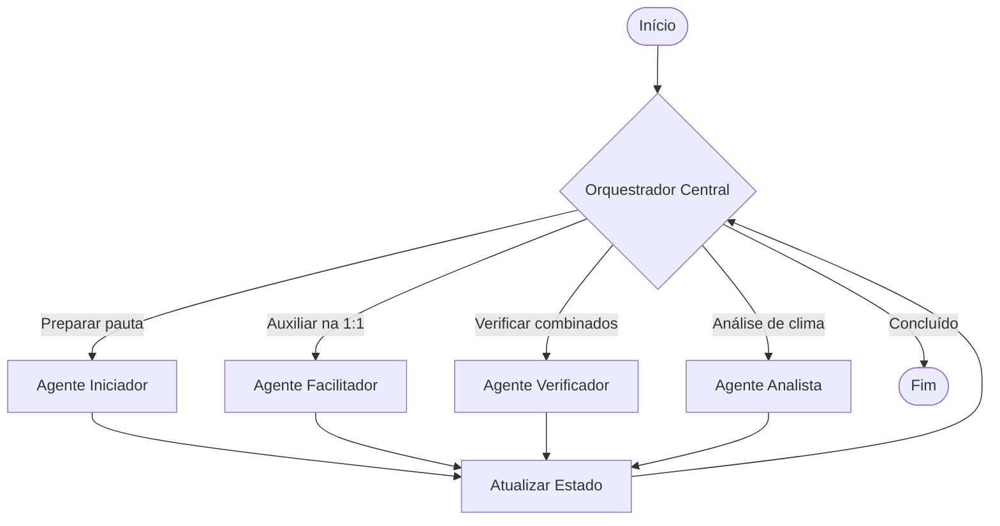

# KB: Orquestração Multiagente e LLMs

> **Persona Responsável:** @meta (Research & Knowledge Analyst)
> **Tema:** Orquestração de múltiplos agentes inteligentes utilizando LLMs no produto InoClear AI.

---

## 1. Visão Geral
A orquestração multiagente é um padrão de arquitetura de software onde tarefas complexas são divididas e delegadas a diferentes agentes especializados de IA. Cada agente possui seu próprio conjunto de instruções (prompts), ferramentas (tools) e escopo de atuação.

No contexto do **InoClear AI**, esta abordagem é fundamental para gerenciar o ciclo de reuniões de liderança, dividindo a responsabilidade em quatro agentes especializados:
1. **Iniciador (Initiator Agent):** Prepara a pauta e agenda.
2. **Facilitador (Facilitator Agent):** Apoia a condução da reunião em tempo real.
3. **Verificador (Verifier Agent):** Acompanha prazos, PDIs e acordos pós-reunião.
4. **Analista (Analyst Agent):** Consolida dados gerais e reporta riscos de clima organizacional ao RH.

Essa especialização reduz a complexidade dos prompts individuais, otimiza o uso do contexto das LLMs e reduz a taxa de alucinação comparado a uma única instrução monolítica gigante.

---

## 2. Conceitos Chave
- **State (Estado Compartilhado):** A estrutura de dados central que armazena o histórico da sessão, dados compartilhados e variáveis que todos os agentes podem ler ou modificar.
- **Node (Nó / Agente):** Unidade executora (pode ser uma LLM com um sistema de instruções específico ou uma função tradicional de código).
- **Edge (Aresta / Transição):** Define o fluxo de controle de um nó para o outro, podendo ser condicional (com base no estado ou resposta da LLM).
- **Router (Roteador):** Lógica que decide para qual agente enviar a execução do pipeline de acordo com a intenção do usuário ou dados do State.
- **Tools (Ferramentas):** Funções externas que um agente pode invocar para interagir com o ambiente (ex: salvar no banco de dados, enviar notificação, etc.).

---

## 3. Exemplos Práticos

### Fluxo de Trabalho (Workflow Graph)
Abaixo está a estrutura simplificada de roteamento entre os agentes do InoClear AI:



### Implementação de Roteamento em Python (Pseudocódigo / LangGraph style)

```python
from typing import TypedDict, List, Dict, Any

# 1. Definição do Estado do Grafo
class AgentState(TypedDict):
    current_agent: str
    user_input: str
    meeting_context: Dict[str, Any]
    action_items: List[str]
    rh_flags: List[str]
    messages: List[str]

# 2. Nós (Agentes)
def initiator_agent(state: AgentState) -> Dict[str, Any]:
    print("[Initiator] Planejando pauta da 1:1...")
    # Executa lógica de IA para gerar pauta
    suggested_agenda = "1. Check-in\n2. Status de Entregas\n3. Próximos Passos"
    return {
        "messages": state["messages"] + ["Pauta gerada com sucesso."],
        "meeting_context": {**state["meeting_context"], "agenda": suggested_agenda}
    }

def facilitator_agent(state: AgentState) -> Dict[str, Any]:
    print("[Facilitator] Auxiliando na condução da 1:1...")
    # Executa lógica de IA para guiar o feedback do líder
    return {
        "messages": state["messages"] + ["Guia de condução enviado."],
        "action_items": state["action_items"] + ["Acompanhar prazo da tarefa X"]
    }

def verifier_agent(state: AgentState) -> Dict[str, Any]:
    print("[Verifier] Checando acordos anteriores...")
    return {
        "messages": state["messages"] + ["Acordos verificados."]
    }

def analyst_agent(state: AgentState) -> Dict[str, Any]:
    print("[Analyst] Analisando clima e riscos...")
    # Verifica sentimento e risco de desengajamento
    return {
        "messages": state["messages"] + ["Análise de sentimento concluída."],
        "rh_flags": state["rh_flags"] + ["Alerta de desengajamento: Nível Baixo"]
    }

# 3. Roteador Central (Orquestrador)
def central_router(state: AgentState) -> str:
    user_intent = state["user_input"].lower()
    if "pauta" in user_intent or "preparar" in user_intent:
        return "initiator"
    elif "conduzir" in user_intent or "conversar" in user_intent:
        return "facilitator"
    elif "acordo" in user_intent or "combinado" in user_intent:
        return "verifier"
    elif "analisar" in user_intent or "risco" in user_intent:
        return "analyst"
    return "end"
```

---

## 4. Armadilhas (Gotchas)
- **Agent Loops (Loops Infinitos):** Cuidado com arestas condicionais que podem retornar infinitamente ao mesmo agente se a LLM falhar em preencher uma condição de parada. Defina sempre um limite máximo de iterações (`max_iterations`).
- **State Bloat (Inchaço de Estado):** Carregar todo o histórico de conversas e metadados no `State` compartilhado pode rapidamente ultrapassar o limite de tokens da janela de contexto da LLM. Limpe periodicamente dados não essenciais do estado.
- **Inconsistência de Estado Concorrente:** Se múltiplos agentes tentarem editar a mesma chave do `State` de forma assíncrona, podem ocorrer conflitos de escrita. Use travas de concorrência ou modelos de alteração baseados em append-only (como listas).
- **Custo e Latência:** Chamar quatro agentes sequencialmente gera múltiplas requisições de API para a LLM, elevando o tempo de resposta e os custos financeiros. Paralelize a execução de nós independentes sempre que possível.
